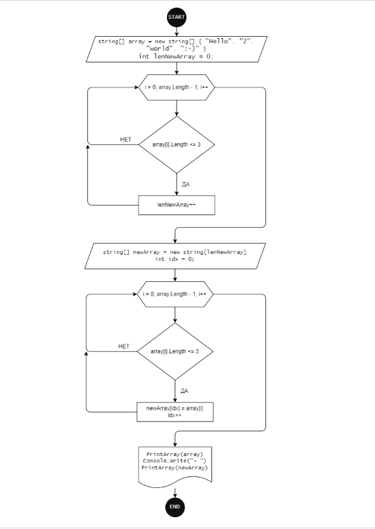

# Итоговая проверочная работа

## Задачи
1. Создать репозиторий на GitHub
1. Нарисовать блок-схему алгоритма (можно обойтись блок-схемой основной содержательной части, если вы выделяете её в отдельный метод)
1. Снабдить репозиторий оформленным текстовым описанием решения (файл README.md)
1. Написать программу, решающую поставленную задачу
1. Использовать контроль версий в работе над этим небольшим проектом (не должно быть так, что всё залито одним коммитом, как минимум этапы 2, 3, и 4 должны быть расположены в разных коммитах)

## Решение
### Задание 2
Создание алгоритма решения задачи

### Задание 3
Описание алгоритма решения задачи
Пользователь указывает сколько элементов (N) он хочет задать и заполняет стартовый массив элементами в цикле N раз.
Далее проходим по стартовому массиву в цикле и проверяем, подходит ли элемент под условие "длина символов <= 3". Если элемент подходит под данное условие, то мы добавляем его в новый массив, используя при этом дополнительный счетчик, чтобы элементы в новом массиве заполнялись последовательно (без пропусков).